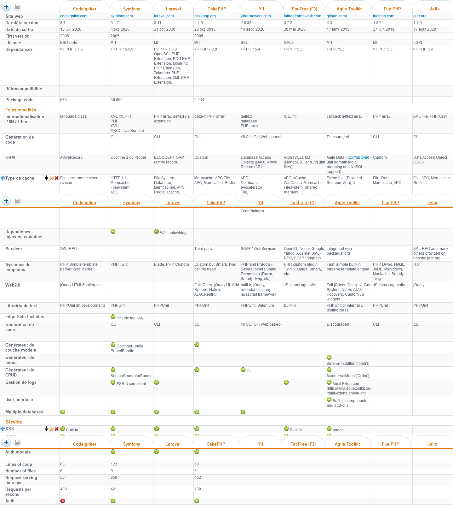

# MY___Bloog

Composer : Composer est un logiciel gestionnaire de dépendances libre écrit en PHP. Il permet à ses utilisateurs de déclarer et d'installer les bibliothèques dont le projet principal a besoin .
 

ORM :object-relational mapper (ORM) that makes it enjoyable to interact with your database. ... In addition to retrieving records from the database table, Eloquent models allow you to insert, update, and delete records from the table as well .
 

artisan : The Laravel PHP artisan serve command helps running applications on the PHP development server .
 

migration : Migration provides a way for easily sharing the schema of the database. It also makes the modification of the schema much easier. It is like creating a schema once and then sharing it many times .
